## Devops
=======================================================================================================
 DevOps CI/CD Pipeline Project: Todo List App

This project demonstrates a complete DevOps CI/CD pipeline setup for a Node.js-based Todo List application using:

📌 Project Overview
The Todo List App allows users to create, update, and delete tasks. The application is:

Developed using the MERN stack

Containerized using Docker

Deployed and automated with Ansible

Integrated into a CI/CD pipeline using GitHub Actions for seamless delivery

---

## 🧩 Project Structure
Todo-List-nodejs/
│── playbook.yml
│── inventory.ini
├── screenshots/
├── .github/
│ └── workflows/
│ └── docker-push.yml
├ └── deploy.yml
├── Dockerfile
├── docker-compose.yml
├── install-docker.yml
├── README.md
└── ...

## Part 1: Dockerizing the Application
🔧 What Was Done
Created a Dockerfile to define the Node.js environment.

Set up a docker-compose.yml to run both the Node.js app and MongoDB container.

Connected frontend and backend using environment variables.

Ensured ports were properly mapped (4000 for app, 27017 for MongoDB).


🗂️ Files Created

      Dockerfile

     docker-compose.yml

     .dockerignore

✅ Commands Used 

 docker build -t todo-app .
 docker-compose up

screenshots:
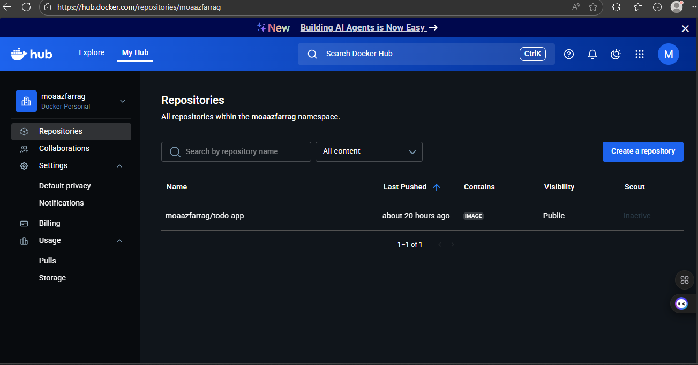
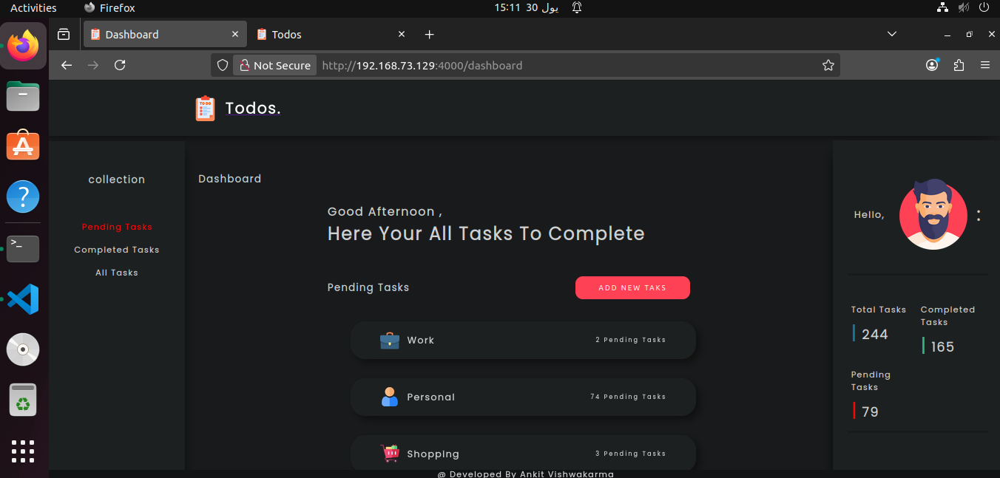
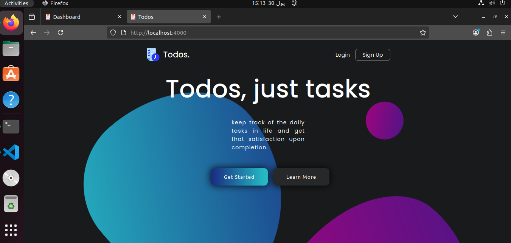
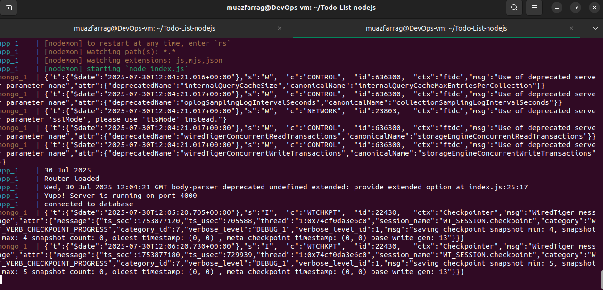
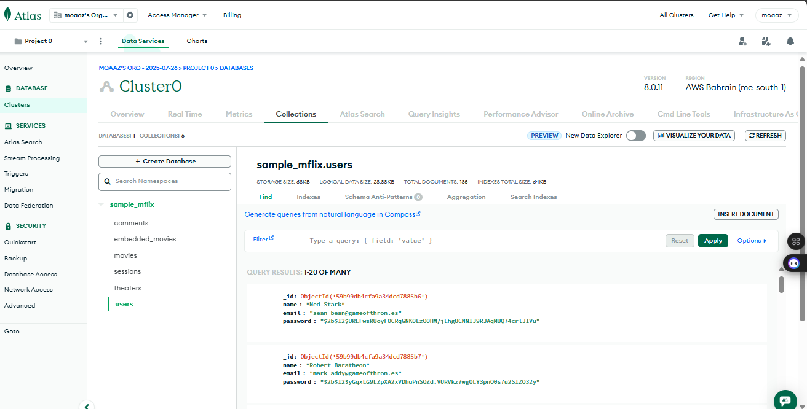


## 🚀 Part 2: Ansible for Remote Docker Deployment
📦 Goal
Automate Docker installation and deployment on a remote Ubuntu VM (tayara).

🧰 What Was Done
Created install-docker.yml playbook to:

Install Docker

Install Docker Compose

Set up inventory.ini to define the remote host

🛠️ Steps
SSH into remote VM manually to test access.

Configure passwordless sudo and SSH with public/private key.

Run playbook from main machine .

✅ Commands Used 
 
 ansible-playbook -i inventory.ini install-docker.yml

screenshots:

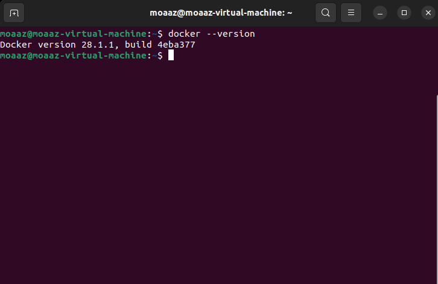
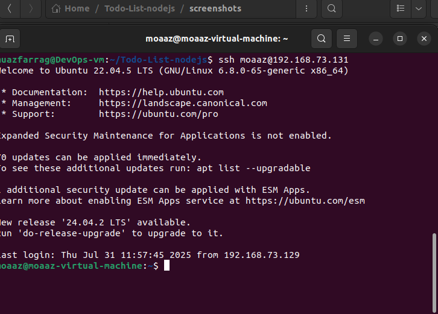
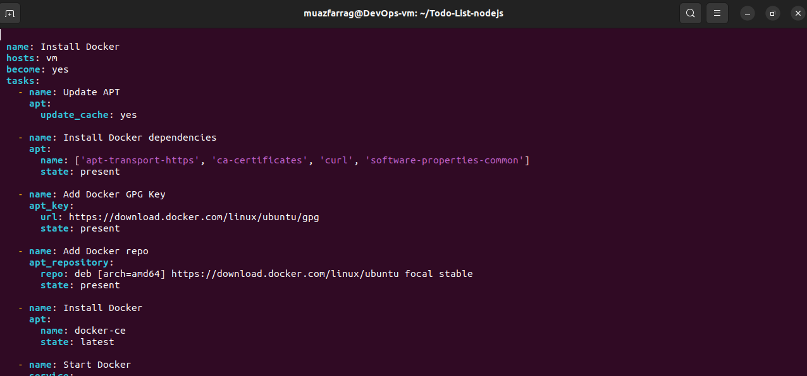

 


## 🔁 Part 3: CI/CD with GitHub Actions
🎯 Objective
Set up a GitHub Actions pipeline to automate testing and deployment to the remote server.

🔐 SSH Key Setup
Created SSH keypair using: ssh-keygen -t rsa -b 4096 -f gha_key


Copied public key to remote VM:
  'ssh-copy-id -i gha_key.pub moaaz@192.168.73.131 '

Saved gha_key and gha_key.pub in root of repo (excluded in .gitignore).

screenshots:

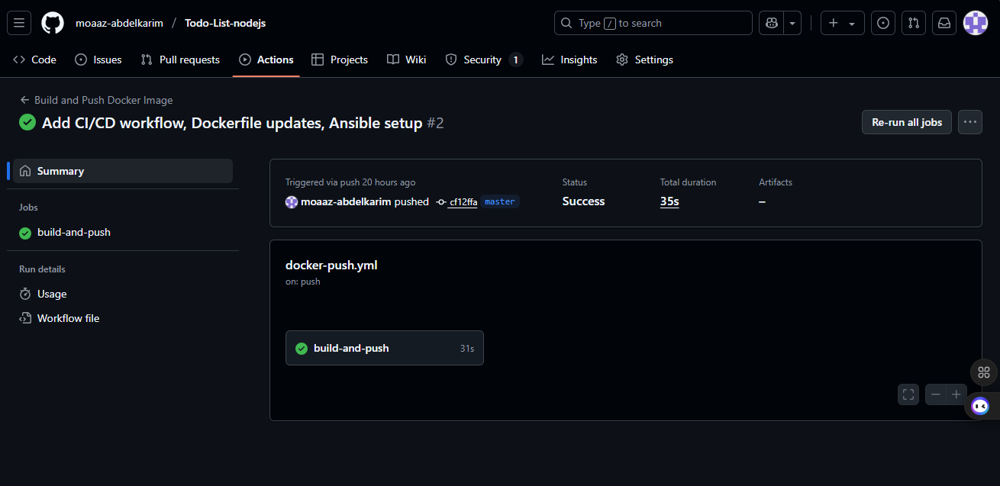

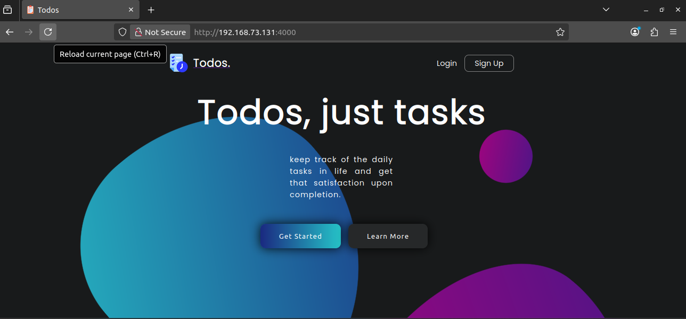
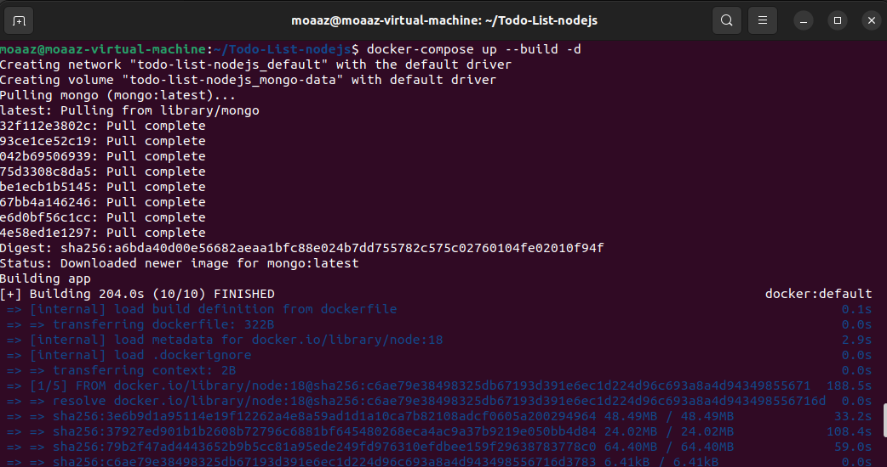


## 📄 Workflow File
Created .github/workflows/deploy.yml with steps:

Checkout repo

Set up Node.js

SSH into remote VM

Pull latest code

Rebuild and restart Docker containers


## 🧪 Test
Pushed to GitHub to trigger the workflow.

Visited http://192.168.73.131:4000 to confirm deployment success.


## 💻 How to Run Locally :
  
    git clone https://github.com/moaaz-abdelkarim/Todo-List-nodejs.git
    cd Todo-List-nodejs
    docker-compose up
   Access the app at http://localhost:4000

## 👤 Author
 Moaaz Farrag
 GitHub: @moaaz-abdelkarim   


## Documentation

[Documentation](https://linktodocumentation)

📝 To-Do List nodeJs

The to-do list application is a web-based application that allows users to create and manage a list of tasks. The user interface consists of a form to add new tasks, a list of all tasks, and controls to mark tasks as complete or delete them.

To create the application, Node.js is used to set up the server and handle the logic of the application. Express.js is used to create the routes for the application, allowing the user to interact with the application through a web browser. EJS is used to create the views for the application, allowing the user to see the list of tasks and the form to add new tasks. CSS is used to style the application, making it visually appealing and easy to use.

MongoDB and Mongoose are used to store the tasks in a database, allowing the user to add, delete, and update tasks as needed. Nodemon is used to monitor changes to the code and automatically restart the server, making it easy to develop and test the application.

When the user adds a new task using the form, Node.js and Express.js handle the request and store the task in the database using Mongoose. When the user views the list of tasks, EJS displays the tasks from the database in a list on the web page. When the user marks a task as complete or deletes a task, Node.js and Express.js handle the request and update the database using Mongoose.

Overall, the todo list application using Node.js, Express.js, EJS, CSS, JavaScript, MongoDB, Mongoose, and Nodemon can be a great way to create a functional and interactive web application that allows users to manage their tasks online. With the right combination of technologies, it is possible to create an application that is both functional and aesthetically pleasing, making it easy for users to manage their tasks in a convenient and efficient way.

Technologies Used: NodeJS, ExpressJS, EJS, CSS, JavaScript, Nodemon, MongoDB, Mongoose.
## Demo

Under process...
## Authors

- [@AnkitVishwakarma](https://github.com/Ankit6098)


## Features

- Create, Update, and Delete Tasks: Enable users to create new tasks, update existing tasks (e.g., mark as completed, edit task details), and delete tasks they no longer need.
- Task Categories provides Implement the ability for users to categorize their tasks into different categories (e.g., work, personal, shopping) or assign labels/tags to tasks for better organization and filtering.
- MongoDb to store your the user data
## Run Locally

Clone the project

```bash
  git clone https://github.com/Ankit6098/Todos-nodejs
```

Go to the project directory and open index.html file

```bash
  cd Todos-nodejs
```

Install the packages

```bash
  npm install / npm i
```

Start the Server

```bash
    npm start / nodemon start
```
## Acknowledgements

 - [nodemon](https://nodemon.io/)
 - [mongoDb](https://www.mongodb.com/)
 - [mongoose](https://mongoosejs.com/)


## Screenshots


## Related

Here are some other projects

[Alarm CLock - javascript](https://github.com/Ankit6098/Todos-nodejs)\
[IMDb Clone - javascript](https://github.com/Ankit6098/IMDb-Clone)


## 🚀 About Me
I'm a full stack developer...


# Hi, I'm Ankit! 👋

I'm a full stack developer 😎 ... Love to Develop Classic Unique fascinating and Eye Catching UI and Love to Create Projects and Building logics.
## 🔗 Links
[](https://ankithub.me/Resume/)

[](https://www.linkedin.com/in/ankit-vishwakarma-6531221b0/)


## Other Common Github Profile Sections
🧠 I'm currently learning FullStack Developer Course from Coding Ninjas

📫 How to reach me ankitvis609@gmail.com


## 🛠 Skills
React, Java, Javascript, HTML, CSS, Nodejs, ExpressJs, Mongodb, Mongoose...


## Feedback

If you have any feedback, please reach out to us at ankitvis609@gmail.com


